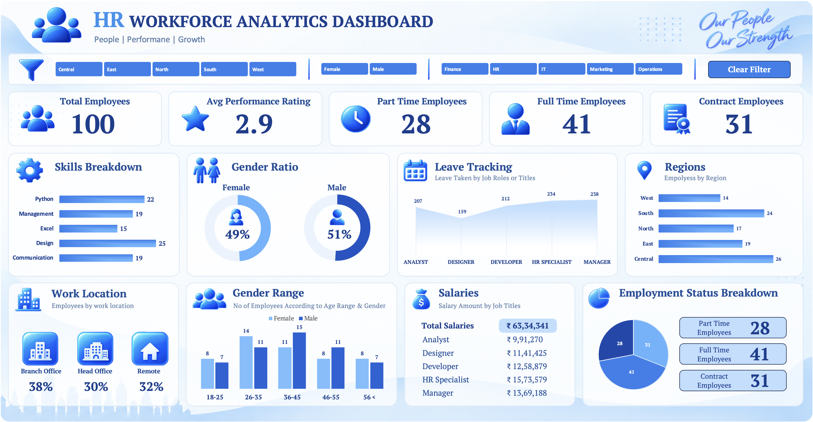
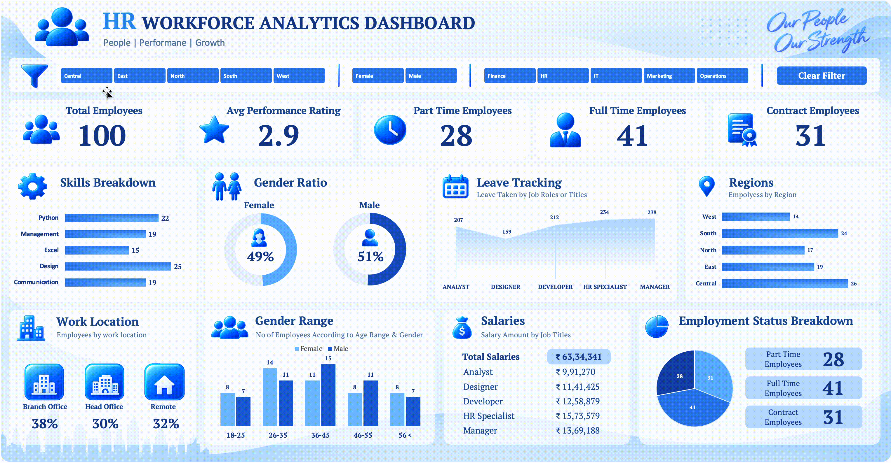

<p align="center">
  
</p>

<h1 align="center"> HR Workforce Analytics Dashboard</h1>

<p align="center">
An interactive Microsoft Excel dashboard that transforms raw HR data into actionable workforce insights through dynamic KPIs, interactive visualisations, slicers, and VBA automation.
</p>

<p align="center">


</p>

---

# Project Overview

The **HR Workforce Analytics Dashboard** is an interactive Microsoft Excel dashboard designed to help HR teams monitor workforce performance, employee distribution, salaries, skills, leave trends, and other key HR metrics from a single dashboard.

The project transforms raw employee records into meaningful insights using **Pivot Tables, Pivot Charts, Excel Formulas, VBA Macros, and Interactive Slicers**.

---

# Business Problem

HR departments often manage large employee datasets, making it difficult to quickly answer questions such as:

- How many employees are currently working?
- What is the workforce composition?
- Which departments employ the most people?
- Which skills are most common?
- How balanced is the gender ratio?
- Which regions require more workforce?
- Which job roles contribute the highest salary expense?
- Which roles take the highest number of leaves?

Without an interactive dashboard, answering these questions requires manual reporting and repetitive analysis.

This dashboard provides all key HR metrics in one place, allowing faster reporting and better decision-making.

---

# Dashboard Preview

<p align="center">

</p>

---

# Dashboard Features

## KPI Cards

-  Total Employees
-  Average Performance Rating
-  Part-Time Employees
-  Full-Time Employees
-  Contract Employees

---

## Interactive Visualisations

- Skills Breakdown
- Gender Ratio
- Leave Tracking
- Employee Distribution by Region
- Work Location Analysis
- Gender Distribution by Age Group
- Salary Analysis
- Employment Status Breakdown

---

## Interactive Filters

Users can dynamically filter the dashboard using slicers.

- Department
- Gender
- Region

---

## Clear All Filters

A custom VBA macro clears all applied slicer selections with a single click, allowing users to instantly reset the dashboard to its default view for a new analysis.

---

# Tools & Technologies

| Tool | Purpose |
|-------|----------|
| Microsoft Excel | Dashboard Development |
| Pivot Tables | Data Aggregation |
| Pivot Charts | Data Visualization |
| Excel Tables | Dynamic Dataset |
| Slicers | Interactive Filtering |
| Linked Text Boxes | Dynamic KPIs |
| Shapes & Icons | Dashboard UI |
| VBA | Clear All Filters Automation |

---

# Dashboard Sections

### Workforce Overview

- Total Employees
- Employment Type
- Average Performance Rating

---

### Workforce Distribution

- Gender Ratio
- Age Group Distribution
- Work Location
- Regional Distribution

---

### Employee Analysis

- Skills Breakdown
- Leave Tracking
- Salary Analysis

---

### Employment Analysis

- Full-Time Employees
- Part-Time Employees
- Contract Employees

---

# Key Insights

Using the sample dataset, the dashboard enables users to quickly identify:

- Total workforce strength
- Employment type distribution
- Overall performance rating
- Most common employee skills
- Workforce gender diversity
- Regional employee distribution
- Work location allocation
- Salary distribution by job role
- Leave trends across job roles

---

# Excel Skills Demonstrated

### Data Preparation

- Excel Tables
- Dynamic Named Ranges
- Linked Cells
- Data Cleaning

### Data Analysis

- Pivot Tables
- Pivot Charts
- Aggregation
- Percentage Analysis
- Workforce Analytics

### Dashboard Development

- Interactive KPI Cards
- Custom Dashboard Design
- Dynamic Text Boxes
- Professional Layout Design
- Interactive Navigation

### Automation

- VBA Macro
- Slicer Automation
- Dashboard Reset Automation

---

# How to Use

1. Download the Excel Workbook.
2. Enable Macros.
3. Open the Dashboard sheet.
4. Use the slicers to filter data.
5. Click the Clear Filter button to remove all slicer selections.

---

# Repository Structure

```
HR-Workforce-Analytics-Dashboard
│
├── Assets
│   ├── Icons
│   ├── Background
│   └── GIF.gif
│
├── Dashboard.png
├── HR Workforce Dashboard.xlsm 
└── README.md
```

---


# About Me


### **Ashish Gautam**

**Data Analyst | SQL | Excel | Power BI**

**Email:** ashishgautam323@gmail.com

**LinkedIn:** https://www.linkedin.com/in/theashishgautam

---
